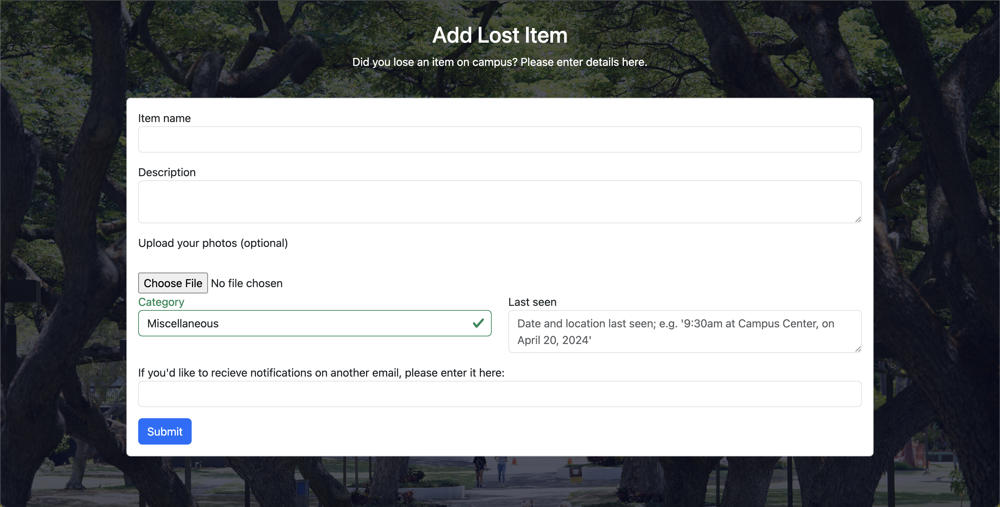
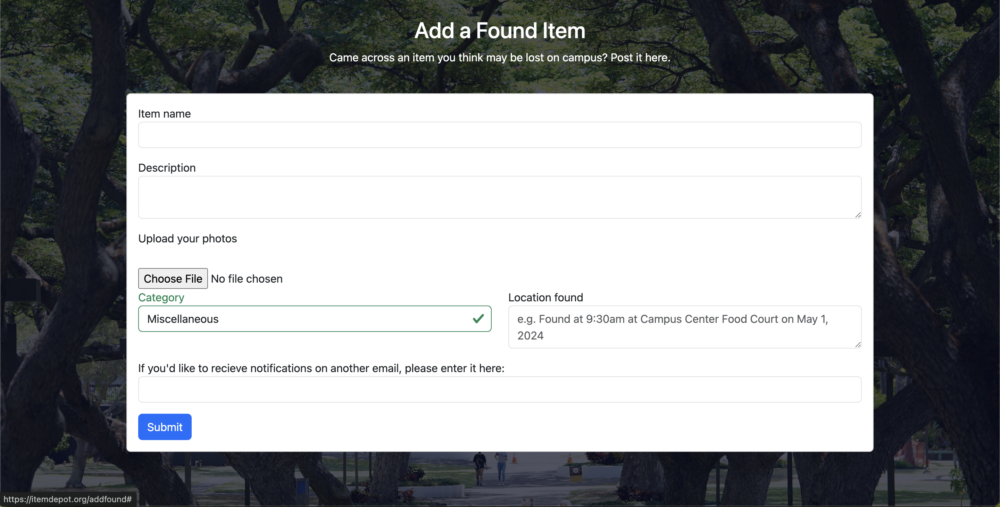
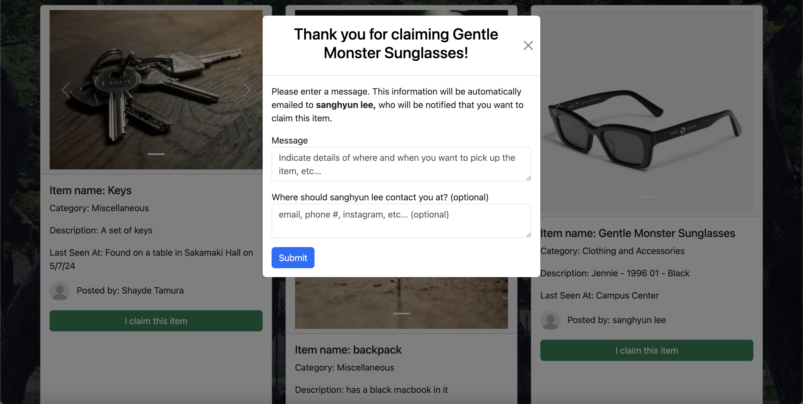
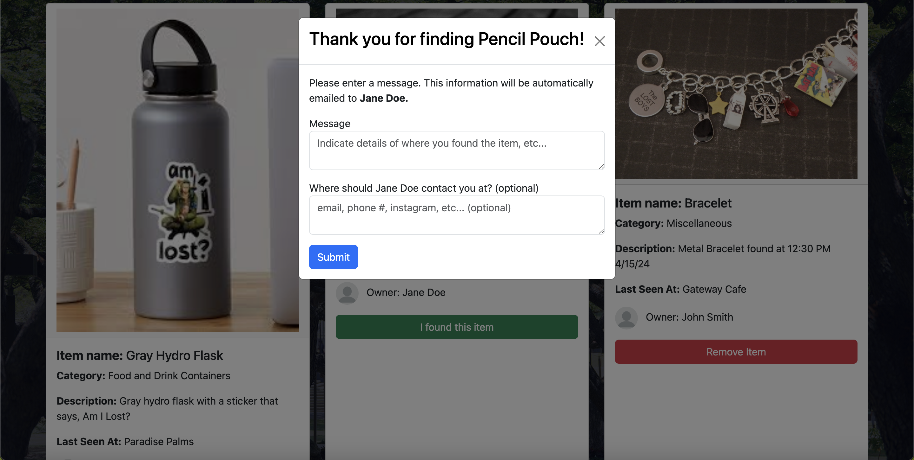
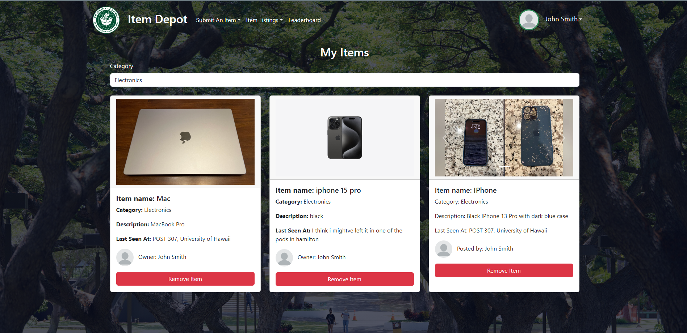
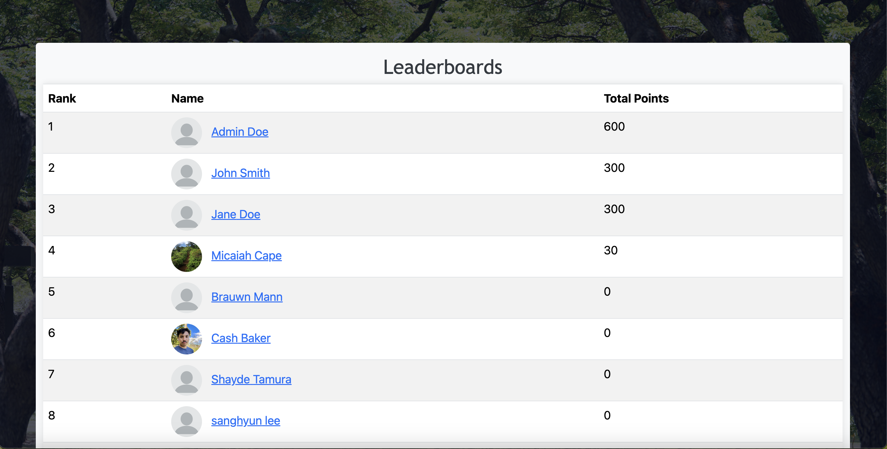
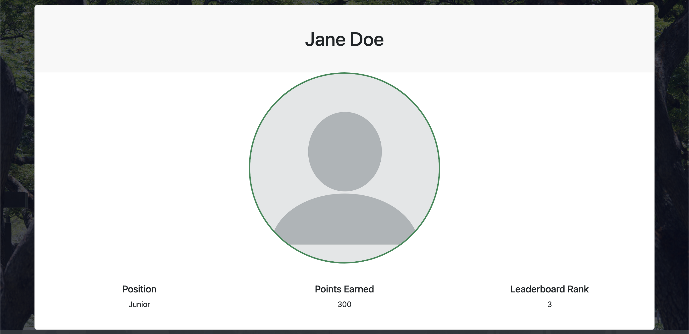

# Item Depot
[](https://github.com/item-depot/item-depot/actions/workflows/ci.yml)
## Table of contents
- [Deployment](#deployment)
- [About Us](#about-us)
- [Overview](#overview)
- [Developer Guide](#developer-guide)
- [User Guide](#user-guide)
- [Page Mockups](#page-mockups)
- [Milestone 1](#milestone-1)
- [Milestone 2](#milestone-2)
- [Milestone 3](#milestone-3)
- [Community Feedback](#community-feedback)

## Deployment
<hr>
The link to the DigitalOcean application can be found [here](https://itemdepot.org)

## About Us
<hr>

### [Team Contract](https://docs.google.com/document/d/1k-PfDflZr52WZuJxB2pzgbMgv5pclSdwkexoAjMBo_o/edit?usp=sharing)
Team Members: Cash Baker, Shayde Tamura, Sam Doan, Darrius Dacquel, Micaiah Cape

### Our Coordination Strategy
Meeting once or twice a week over discord. Some of our contribution criteria may be timeliness and reliability, general quality of work, level of communication and professionalism. Regarding code conflicts, we will try our best to avoid them, but if we have to, each member should have the right to explain why his code may be better to be pushed into production. Then, we will vote to see which chunk of code is better, and the majority decides.

### Our Mission 
To create an innovative lost-and-found system for UH Manoa where users can report missing items so that others can find it. We can gamify the system to reward points for those that found an item quickly, and build a leaderboard.

## Overview
<hr>
Losing personal belongings is a common occurrence among students in university environments, often resulting in frustration, inconvenience, and in most cases, financial loss. Many students misplace items such as water bottles, lunch boxes, student ID, device chargers, and much more. Traditional methods of retrieving lost items, such as posting flyers or contacting campus security, can be time-consuming and inefficient. Moreover, the lack of a centralized platform for reporting and locating lost items creates barriers to successful recovery. This problem worsens by the fast-paced nature of university life, where students move between classes, study areas, and recreational spaces throughout the day. Without a streamlined and technologically advanced solution, the process of recovering lost items remains cumbersome leading to stress and… sadness.

The lost and found UH Manoa app will provide a comprehensive way to reunite community members with their wallets, phones, and any other valuables. There will be a list of lost items and a list of found items. There will be a field indicating where the item is. Someone who has lost an item can also post what they have lost. They could also see the list of lost items. The person who finds an item can disable any incoming messages if it’s indicated that the item is left in designated spaces like the Campus Center and ID Office.

## Developer Guide

1. cd into the `/app` folder.
2. Install meteor if needed (see instructions [here](https://docs.meteor.com/install.html)).
3. Run `meteor npm run start` to start the app. The app should start running in a few minutes, and the output should look similar to this:

```
> meteor-application-template-react@ start C:\Users\mchlc\projects\lost-and-found\app
> meteor --no-release-check --exclude-archs web.browser.legacy,web.cordova --settings ../config/settings.development.json

[[[[[ C:\Users\mchlc\projects\lost-and-found\app ]]]]]

=> Started proxy.
=> Started HMR server.
=> Started MongoDB.
I20240423-23:04:44.739(-10)? Creating the default user(s)
I20240423-23:04:44.849(-10)?   Creating user admin@foo.com.
I20240423-23:04:44.899(-10)?   Creating user john@foo.com.
I20240423-23:04:44.993(-10)?   Creating user jane@foo.com.
I20240423-23:04:45.096(-10)? Creating default data.
I20240423-23:04:45.096(-10)?   Adding: Basket (john@foo.com)
I20240423-23:04:45.118(-10)?   Adding: Bicycle (john@foo.com)
I20240423-23:04:45.120(-10)?   Adding: Banana (admin@foo.com)
I20240423-23:04:45.123(-10)?   Adding: Boogie Board (admin@foo.com)
=> Started your app.

=> App running at: http://localhost:3000/
   Type Control-C twice to stop.

```

4. To run eslint, run `meteor npm run lint`.

**Note: if you're using Git Bash, you would have to type `meteor.bat` instead of `meteor` for every command that you execute.

## User Guide

- **Home Page:** From the Home Page you can Log In/Sign Up to then have acess to the Item Depot website, also have options to navigate Campus Map, as well as direct links to all parts of the website

   
   
    

- **Submit Lost Item Page** Able to upload an item that you have lost with data such as where it was last seen, category of the item, contact info, and picture(s).

  

- **Submit Found Item Page** Able to upload an item that you have found with data such as where it was found, category of the item, contact info, and picture(s).

  

- **Found Item Page** Page holds all items that have been found with their respective info/picture(s). You can filter found items based on their category. As well as claim said items, and contact person who posted that item.

    
   

- **Lost Item Page** Page holds all items that have been lost with their respective info/pictures. You can also filter lost items based on their category. As well as claim said items, and contact person who posted that item.

   
   


- **My Items Page** View all items posted by your account

   

- **Item Archive** View all past found/lost items that have been resolved

  

- **Leaderboard Page** View accounts with most found items, users are rewarded points when giving back to the UH community.

  

- **View Profile** Able to view other account profiles

  

## Page Mockups
<hr>

 - **Landing page**

   The landing contains: Welcome message / login button, a Button that says “I lost an item”, a Button that says “I found a potentially lost item”, and a Button that says “I found a lost item”

   
   <br><br>

 - **User profile page**

   The profile page of the user that is logged in. Shows first name, last name, point total, profile picture, any lost items, any items that they found.

   
   <br><br>

 - **“I lost an item” page / Submit a lost item**

   Dropdowns/forms that the user can fill out about a lost item. Some information the user fills out may include what the item is, a description of it, a picture of the item, and when they last found the item. The user can also fill out their contact info if they need to be contacted about the item.

   
   <br><br>

 - **“Found a potentially lost item” page**

   A form for an item that is potentially lost, but isn’t considered “officially” lost according to the website. For example, if Person A loses their UH ID and is not aware that they lost it, they will not submit this lost UH ID on the “I lost an item” page. If Person B happens to randomly come across the UH ID, Person B can submit the form on this page saying they came across the UH ID at (location) during (time of day), so Person A can check this page to see if anyone has found it already, without having to submit info on the “I lost an item” page.

   
   <br><br>

 - **Search “potentially found items” page**
   
   Contains a list of items that were submitted via the “Found a potentially lost item” page. Also sortable alphabetically, by date lost, type of item lost, near a certain building on campus, or keyword. Every item has a button that a user can click if it has been retrieved.

   
   <br><br>

 - **Search found items page**
   
   Contains an archive of list of items that were found, showing the item name, date lost, the date found, and who found it.

   
   <br><br>

 - **Search lost items page**
   
   Contains a list of lost items that were submitted via the “I lost an item” page. sortable alphabetically, by date lost, type of item lost, near a certain building on campus, or keyword. Every item has a button that a user can click if they were found.

      
      <br><br>

 - **Points Leaderboard**
   
   Showcase of top 10 users with the most points

## Milestone 1
<hr>

### [M1 Progress Page](https://github.com/orgs/item-depot/projects/1)
- **Landing page**
  
   
   <br><br>
   
- **Sign In Page**
  
   
   <br><br>

- **Sign Up Page**
  
   
   <br><br>

- **Submit a Found Item**
  
   
   <br><br>

- **Submit a Lost Item**
  
   
   <br><br>

## Milestone 2
<hr>

### [M2 Progress Page](https://github.com/orgs/item-depot/projects/4/views/1)

  - **Home Page:** From the Home Page you can Log In/Sign Up to then have acess to the Item Depot website

     

  - **Sign up Page:** On the Sign Up Page you can create an account and also have the option to add a profile picture

     

  - **Logged in Page:** Option of two dropdown menus that link to the Lost item/Found Item Forms and the Item Listings pages

     

     

  - **Submit Lost Item Page** Able to upload an item that you have lost with data such as where it was last seen, category of the item, and contact info

     

  - **Submit Found Item Page** Able to upload an item that you have found with data such as where it was found, category of the item, and contact info

     
 
  - **Found Item Page** Page holds all items that have been found with their respective info/pictures. You can also filter found items based on their category.

     

     

     

  - **Lost Item Page** Page holds all items that have been lost with their respective info/pictures. You can also filter lost items based on their category.

     

     

<hr>

## Milestone 3
<hr>

### [M3 Progress Page](https://github.com/orgs/item-depot/projects/5/views/1)

## Community Feedback
<hr>

#### Kyle 

He finds the website appealing and sees it as a good platform, but raises concerns about false claims. He plans to utilize social media first for item postings, resorting to the website if necessary.

#### Logan 

Logan appreciates the website but notes the small login button. He prefers social media for broader reach but would consider the website if it gains more traction.

#### Weston 

Weston praises the website's features and the map function but worries about false claims. He suggests adding a contact support feature and preventing spamming. Weston would utilize the website before resorting to social media for lost items.

#### Xavi 

Xavi finds the website aesthetically pleasing and user-friendly but questions the necessity of a leaderboard. He emphasizes the importance of reaching a broad audience, preferring social media if it achieves wider visibility.

#### Bryson 

Bryson commends the website's simplicity and readability, expressing interest in the leaderboard feature. He suggests adding features for email and profile picture changes. Bryson favors using the website over social media for lost items but suggests improving the category filter button's appearance.
   
