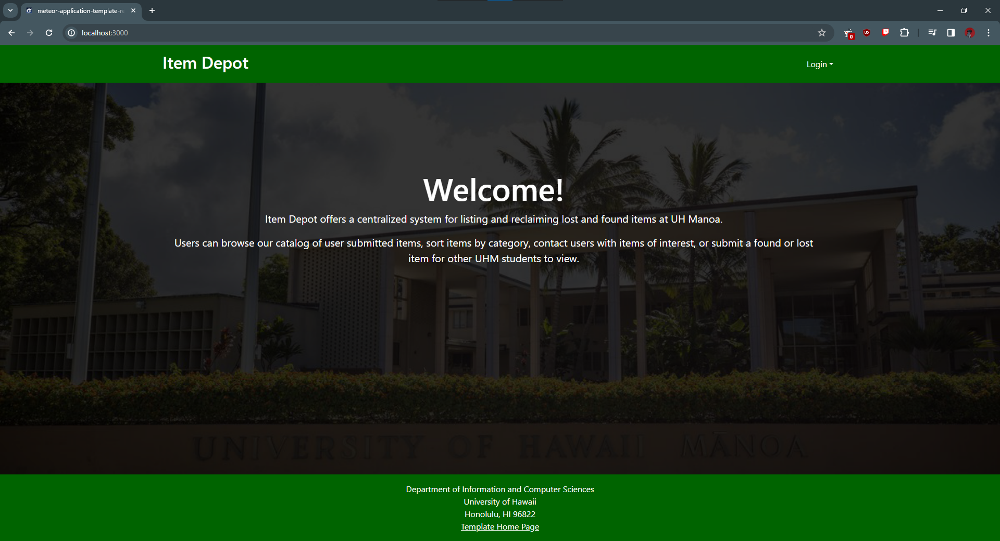

# Item Depot

## Table of contents
* [Deployment](#deployment)
* [About Us](#about-us)
* [Overview](#overview)
* [Milestone 1](#milestone-1)
* [Milestone 2](#milestone-2)
* [Page Ideas](#page-ideas)
* [Use Cases](#use-cases)
* [Beyond The Basics](#beyond-the-basics)

## Deployment

The link to the DigitalOcean application can be found [here](http://165.232.149.224)

## About Us

### [Team Contract](https://docs.google.com/document/d/1k-PfDflZr52WZuJxB2pzgbMgv5pclSdwkexoAjMBo_o/edit?usp=sharing)
Team Members: Cash Baker, Shayde Tamura, Sam Doan, Darrius Dacquel, Micaiah Cape

### Our Coordination Strategy
Meeting once or twice a week over discord. Some of our contribution criteria may be timeliness and reliability, general quality of work, level of communication and professionalism. Regarding code conflicts, we will try our best to avoid them, but if we have to, each member should have the right to explain why his code may be better to be pushed into production. Then, we will vote to see which chunk of code is better, and the majority decides.

### Our Mission 
To create an innovative lost-and-found system for UH Manoa where users can report missing items so that others can find it. We can gamify the system to reward points for those that found an item quickly, and build a leaderboard.

## Overview

Losing personal belongings is a common occurrence among students in university environments, often resulting in frustration, inconvenience, and in most cases, financial loss. Many students misplace items such as water bottles, lunch boxes, student ID, device chargers, and much more. Traditional methods of retrieving lost items, such as posting flyers or contacting campus security, can be time-consuming and inefficient. Moreover, the lack of a centralized platform for reporting and locating lost items creates barriers to successful recovery. This problem worsens by the fast-paced nature of university life, where students move between classes, study areas, and recreational spaces throughout the day. Without a streamlined and technologically advanced solution, the process of recovering lost items remains cumbersome leading to stress and… sadness.

The lost and found UH Manoa app will provide a comprehensive way to reunite community members with their wallets, phones, and any other valuables. There will be a list of lost items and a list of found items. There will be a field indicating where the item is. Someone who has lost an item can also post what they have lost. They could also see the list of lost items. The person who finds an item can disable any incoming messages if it’s indicated that the item is left in designated spaces like the Campus Center and ID Office.

## Milestone 1

### [M1 Progress Page](https://github.com/orgs/item-depot/projects/1)
- **Landing page**
  
   
     
   
- **Sign In Page**
  
   
     

- **Sign Up Page**
  
   
     

- **Submit a Found Item**
  
   
     

- **Submit a Lost Item**
  
   
     

## Milestone 2

### [M2 Progress Page](https://github.com/orgs/item-depot/projects/4/views/1)

### User Guide

  - **Home Page:** From the Home Page you can Log In/Sign Up to then have acess to the Item Depot website

     

  - **Sign up Page:** On the Sign Up Page you can create an account and also have the option to add a profile picture

     

  - **Logged in Page:** Option of two dropdown menus that link to the Lost item/Found Item Forms and the Item Listings pages

     

     

  - **Submit Lost Item Page** Able to upload an item that you have lost with data such as where it was last seen, category of the item, and contact info

     

  - **Submit Found Item Page** Able to upload an item that you have found with data such as where it was found, category of the item, and contact info

     
 
  - **Found Item Page** Page holds all items that have been found with their respective info/pictures. You can also filter found items based on their category.

     

     

     

  - **Lost Item Page** Page holds all items that have been lost with their respective info/pictures. You can also filter lost items based on their category.

     

     

### Developer Guide

## Milestone 3

### [M3 Progress Page](https://github.com/orgs/item-depot/projects/5/views/1)

## Page Ideas

 - **Landing page**

   The landing contains: Welcome message / login button, a Button that says “I lost an item”, a Button that says “I found a potentially lost item”, and a Button that says “I found a lost item”

   
     

 - **User profile page**

   The profile page of the user that is logged in. Shows first name, last name, point total, profile picture, any lost items, any items that they found.

   
     

 - **“I lost an item” page / Submit a lost item**

   Dropdowns/forms that the user can fill out about a lost item. Some information the user fills out may include what the item is, a description of it, a picture of the item, and when they last found the item. The user can also fill out their contact info if they need to be contacted about the item.

   
     

 - **“Found a potentially lost item” page**

   A form for an item that is potentially lost, but isn’t considered “officially” lost according to the website. For example, if Person A loses their UH ID and is not aware that they lost it, they will not submit this lost UH ID on the “I lost an item” page. If Person B happens to randomly come across the UH ID, Person B can submit the form on this page saying they came across the UH ID at (location) during (time of day), so Person A can check this page to see if anyone has found it already, without having to submit info on the “I lost an item” page.

   
     

 - **Search “potentially found items” page**
   
   Contains a list of items that were submitted via the “Found a potentially lost item” page. Also sortable alphabetically, by date lost, type of item lost, near a certain building on campus, or keyword. Every item has a button that a user can click if it has been retrieved.

   
     

 - **Search found items page**
   
   Contains an archive of list of items that were found, showing the item name, date lost, the date found, and who found it.

   
     

 - **Search lost items page**
   
   Contains a list of lost items that were submitted via the “I lost an item” page. sortable alphabetically, by date lost, type of item lost, near a certain building on campus, or keyword. Every item has a button that a user can click if they were found.

      
        

 - **Points Leaderboard**
   
   Showcase of top 10 users with the most points
   
## Use Cases

1. A person who has found an item or lost an item will go through the landing page then sign in with their uh username.
2. A user can either submit a lost item by filling out info, or scroll thru the lost items page and hit a button on that page if they found a particular item. This opens up a space where a user can leave a short message for the person who lost the item (e.g. where they found it, if the item is going to be moved somewhere, etc…)
3. Alternatively, if a user may have come across an item that seems lost, but not officially on the “lost items” page (talking about finding an item before someone becomes aware that they lost it), the user can also submit a potential lost item, filling out similar info to the lost item.

## Beyond the Basics

Possible ideas that could be implemented to make our app special in comparison to others.

 - **User Ratings:** Implement a simple user rating system where users can rate their experience with other users based on the successful retrieval of lost items. This encourages positive interactions within the community. Or, gamify the platform where users can score points based on “how quickly” they find a lost item.
 - **Quick Search Filters:** Offer quick search filters (e.g., by item type, location, date) to help users narrow down their search results and find relevant listings more efficiently.
